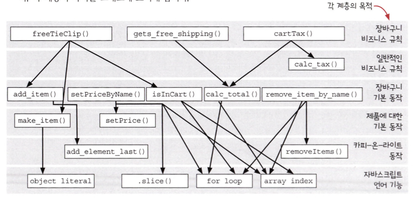

## Category Theory for Programmer

- [이론 살펴보기](https://github.com/ssuojae/functional_programming/blob/main/category_theory.md)

<br/>

## Fundamental

#### #1 .함수형 프로그래밍은 평가 시점으로부터 자유롭다.

```javascript
var c = 10;
function add2(a, b) {
    return a + b + c;
}

// 평가 시점에 따라 값이 다른다는 것을 알 수 있다.
console.log(add2(10, 2)); // 22
c = 20
console.log(add2(10, 2)); // 33
```
- 절차형은 평가시점에 따라 결과값이 달라진다.

<br/>

```javascript
function add(a, b) {
    return a + b;
}

console.log(add2(10, 2)); // 32
console.log(add2(10, 2)); // 32
```
- 반면 순수함수로된 FP는 평가시점과 관계없이 결과값이 같다.
- "데이터 구조"가 먼저 선언되는 것이 아닌 "함수"가 중심이 되어야한다.
- 위와 같이 평가시점이 결과에 영향을 미치지 않기 때문에 조합성을 증대시킨다.

<br/>
<br/>

#### #2. 함수내에서 조건에 따른 처리를 함수 인자를 통해 처리한다.

```javascript
// 30세 이상 유저 뽑아내기
var temp_users = [];
for (var i = 0; i < users.length; i++) {
    if (users[i].age >= 30) {
        temp_users.push(users[i]);
    }
}
console.log(temp_users);
```
- 기존 절차형에서는 함수 내에서 조건문을 위와같이 작성할 수 있다.

<br/>

```javascript
var users = [
    {id: 1, name: 'ID', age: 36},
    {id: 9, name: 'DI', age: 23},
];

//predi 함수에게 30세 기준 조건 위임하기 -> 이렇게 함수를 인자로 받는걸 응용형 프로그래밍이라고 함
function _filter(users, predi) {
    var new_list = [];
    for (var i = 0; i < users.length; i++) {
        if (predi(users[i])) {
            new_list.push(users[i]);
        }
    }
    return new_list;
}

console.log(
    _filter(users, function (users) {
        return users.age >= 30;
    })
);

console.log(
    _filter(users, function (users) {
        return users.age < 30;
    })
)
```

<br/>
<br/>

#### #3 .함수 내부에서는 데이터 구조가 드러나서는 안된다.

```javascript
var users = [
    {id: 1, name: 'ID', age: 36},
    {id: 9, name: 'DI', age: 23},
];

function _map(list, mapper) {
    var new_list = [];
    for (var i = 0; i < list.length; i++) {
        new_list.push(mapper(list[i]));
    }
    return new_list;
}

var over_30 = _filter(users, function (user) {
    return user.age >= 30;
});

console.log(over_30);

var names = _map(over_30, function (user) {
    return user.name;
});

console.log(names);
```
- 기존 절차형에서는 함수에서 데이터 구조를 알고 구조에 따른 조건을 걸어 처리했다.
- 반면 함수형은 함수 내부에서 들어오는 데이터에 구조를 알아서는 안된다.
- `map`함수의 내부에서는 `list`가 어떤 데이터 구조인지 알 수 없다.
- 단지 "데이터"와 어떻게 처리할지에 대한 "함수"를 인자로 받는다.

<br/>

<br/>
(Grokking Simplicity - 에릭 노먼드) 
<br/>
- 이렇게 되다보니 자연스럽게 함수들 사이에 계층구조가 생기게 된다.
- `map`, `filter` 에서는 함수를 인자로 받아 조건을 처리해주었었다.
- 이러한 고차함수는 가장 상위 함수 계층에 위치하게 된다.
- 함수 본인은 또다른 함수에 들어가 얼마나 구체적인 동작/조건을 처리해주냐에 따라 계층이 만들어진다.


<br/>
<br/>

#### #4. 함수와 메서드는 다르다. 엄격하게 말하자면 메서드는 FP에 위반된다.


<br/>
<br/>

#### #5. 데이터 구조에 대한 평가시점을 최대한 뒤로 미루어 처리한다.

```javascript
_map = _curryr(_map);

function _identity(val) {
    return val;
}

var _values = _map(_identity);

console.log(_values(users[2])); // [3, 'JM', 32]
```

- 데이터 구조 평가 시점을 뒤로 미룰수록 다형성이라는 이점이 취해진다.
- 즉 어떤 데이터가 오든 일단 로직들이 먼저 오고 만들어진 로직에 데이터를 마지막에 넣는 것이다.
- 여기서 중요한 함수가 바로 `curryr` 과 같은 함수다.
- 인자값으로 (데이터,함수)가 들어오면 `curryr`이 내부에 있으면 먼저 함수부터 넣고 일급시민으로 가지고 있다가 마지막 실제 활용할 때 데이터를 넣는다. 

<br/>
<br/>


#### #6. 컬렉션 중심 프로그래밍에는 대표적으로 4가지 유형 함수가 있다.

1. 수집하는 함수 - `map`, `values`, `pluck`
2. 거르는 함수 - `filter`, `reject`, `compact`, `without`
3. 찾아내는 함수 - `find`, `some`, `every`
4. 접는 함수 - `reduce`, `min`, `max`, `group_by`, `count_by`

- 위의 함수일수록 추상화 레벨이 높다.
- 특히 어떻게든 들어오는 어떤 데이터 구조에 대응하기 위해서 별것 아닌것처럼 보였던 identity 함수 사용이 중요했다.

<br/>
<br/>

#### #7. go함수를 통해 파이프라인을 구축해서 로직을 저장하고 쓸 수 있다.

```javascript
// go 함수 구현
const go = (...args) => args.reduce((acc, fn) => fn(acc));

// 예제 데이터
const numbers = [1, 2, 3, 4, 5];

// 파이프라인으로 숫자 처리하기
const result = go(
numbers,
nums => nums.map(num => num * 2),     // 모든 숫자를 2배로
nums => nums.filter(num => num > 5),  // 5보다 큰 숫자만 필터링
nums => nums.reduce((a, b) => a + b)  // 남은 숫자의 합 구하기
);

console.log(result);  // 36
```
- 마치 피라미드를 쌓듯이 작은 조건 순수함수들을 가지고 더 큰 로직들을 파이프라이닝을 통해 구축할 수 있다.
- 파이프라인 함수형 프로그래밍은 데이터 처리를 일련의 함수들로 연결하여, 데이터를 순차적으로 변환한다. 
- 데이터의 흐름을 명확하게 만들고, 코드를 더 모듈화하고 재사용 가능하게 한다.