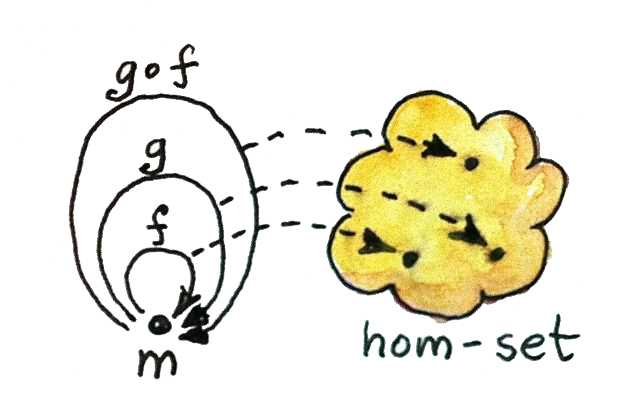
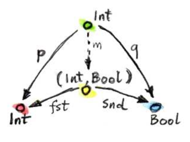
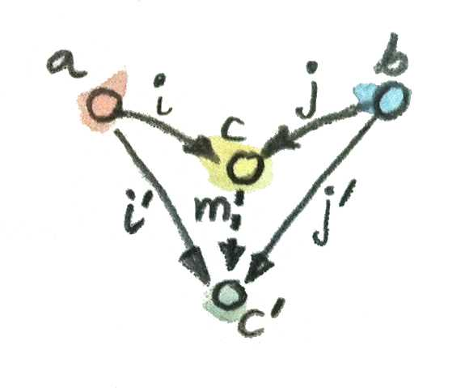

## Category Theory for Programmers - Bartosz Milewski


책 내용의 난이도가 높아 이해하지 못한 부분은 제외하고 이해한 부분을 중심으로 정리했습니다 :) <br/>
연한 텍스트는 인용구, 기본 텍스트는 저의 생각을 정리해보았습니다. :)


<br/>

#### CHAPTER01. 카테고리: 합성의 본질

>카테고리는 대상과 그 사이를 이어주는 화살표로 구성된다. 따라서 카테고리의 본질은 합성이다. 반드시 대상 A에서 C로 향하는 화살표, 즉 A->B와 B->C의 합성이 존재해야한다.

> 합성을 만족시키기 위해서는 두가지 조건이 필요하다. 바로 결합법칙 성립과 모든 대상 A에는 항등 개념을 가진 화살표가 존재해야한다는 것이다.

> 함수의 본문은 항상 표현식(expression)이며, 문(statement)은 존재하지 않는다. (반환값이 반드시 있다.)

> 즉 우아한 코드는 우리의 뇌가 처리할 수 있는 적절한 크기, 적절한 개수의 청크를 만들어내는 것이라고 볼 수 있다. 그렇다면 적합한 청크는 무엇일까? 먼저 청크의 면적은 청크의 부피보다 느리게 증가해야한다. (면적: 외부에서 필요한, 합성하는데 필요한 정보, 부피: 구체적인 구현 정보)

> 객체지향에서 면적은 클래스나 인터페이스이지만, 함수형에서는 함수의 선언이라고 볼 수 있다.

```javascript
const add = (a, b) => a + b;
```
- **면적**: add 함수의 입력과 출력은 그 면적입니다. 즉, 이 함수는 두 개의 숫자를 받아 그 합을 반환하는 역할이 면적이다.
- **부피**: add 함수 내부에서 실제로 a + b라는 덧셈이 수행되는 연산이 부피

<br/>

#### CHAPTER02. 타입과 함수
>타입체킹은 무의미하게 작성된 프로그램에 대한 하나의 방어막이다. 정적체크되는 타입 불일치는 컴파일 타임에 발견되기 때문에 굳이 실행해 보지않더라도 잘못된 프로그램을 잡아낸다.

>임의의 두 화살표를 아무렇게나 합성할 수 있는 것은 아니다. 한 화살표의 목표인 대상은 다음 화살표의 출발 대상과 동일해야한다. 즉 하ㅂ성이 제대로 되려면 양 끝단이 일치해야 한다는 것이며 타입시스템이 강력할수록 이러한 일치여부를 잘 표현하고 검증할 수 있다.

>우리가 명령형 언어에서 함수라고 부른 것들은 수학자들이 함수라고 부르는 것과는 약간 다른 개념이다. 수학적 함수는 그저 어떠한 값들 간의 사상(Mapping)일 뿐이기 때문이다.

<br/>

#### CHAPTER03. 다양한 카테고리들
>Thin 카테고리는 대상 a에서 대상 b로 가는 사상이 최대 1개만 존재하는 카테고리이다. 원순서 집합이 Thin 카테고리에 해당한다. (원순서 집합: 작거나 같다"는 관계를 나타내는 집합 a ≤ b)

> Hom 집합은 두 대상 사이의 모든 사상들의 집합이다. 예를 들어, 카테고리 C에서 대상 a와 b가 있을 때, Hom 집합은 a에서 b로 향하는 모든 사상들의 집합을 의미한다. 이를 수학적으로 C(a, b) 또는 **Hom(C, a, b)** 로 표현한다.

> 모노이드는 이항연산을 가진 집합으로 정의된다. 이 이항연산은 결합법칙을 만족해야하며 연산에 대해 상등원 같은 특별한 원소가 하나 있어야 한다. 예를 들어 0을 포함하는 자연수 집합은 덧셈에 대해 모노이드를 이룬다. 

```javascript
// 문자열 모노이드: 이항 연산은 문자열 결합, 항등원은 빈 문자열
const concat = (a, b) => a + b;
const identity = "";

// 두 개의 문자열을 결합
let result = concat("Hello, ", "World!"); // "Hello, World!"
console.log(result);

// 항등원을 사용하여 결합
let resultWithIdentity = concat("Hello", identity); // "Hello"
console.log(resultWithIdentity);
```
- 함수형 프로그래밍에서 모노이드는 데이터 결합을 다루는 데 유용하다. 예를 들어, 여러 개의 값을 결합하는 연산은 모노이드의 결합법칙과 항등원 성질을 활용하여 구현할 수 있다. 이 과정에서 불변성을 유지하면서 연산을 처리할 수 있다.



>관점을 바꿔 이항연산을 적용한다는 것을 어떤 대상에서 다른 대상으로 "이동"하는 것으로 생각해보자. 어떤 수 n에 대해서 다시 n을 더하는 "Adder" 함수가 있다고 생각배호자. 이 Adder는 어떤 방식으로 합성될까? 5를 더하는 함수와 7을 더하는 함수를 합성하면 12를 더하는 함수가 될 것이다. 즉 Adder들 간의 합성은 덧셈 규칙을 그대로 유지한다고 볼  수 있다. 그렇다면 덧셈이라는 개념을 함수의 합성이라 생각해도 문제없을 것이다. 

<br/>

#### CHAPTER04. 크라이슬리 카테고리
```javascript
// Writer 모나드를 간단히 표현하기 위한 구조
function writer(value, log) {
return { value, log };
}

// isEven 함수: 숫자가 짝수인지 확인하고 로그를 남김
function isEven(n) {
const result = n % 2 === 0;
return writer(result, `Checked if ${n} is even. `);
}

// negate 함수: 논리값을 반전시키고 로그를 남김
function negate(b) {
return writer(!b, `Negated the value. `);
}

// 두 함수를 합성: 숫자를 짝수인지 확인하고 결과를 반전
function isOdd(n) {
const p1 = isEven(n);
const p2 = negate(p1.value);
return writer(p2.value, p1.log + p2.log); // 값과 로그를 합침
}

// 사용 예시
const result = isOdd(4);
console.log(result.value); // false
console.log(result.log);   // "Checked if 4 is even. Negated the value. "
```
- 순수함수를 유지하기 위해서는 메모이제이션이라는 문제가 있다. 전역없이 메모이제이션을 해가며 함수를 계속 호출해야하기 때문이다. 따라서 재귀함수가 FP 전반적으로 도입될 수 밖에 없다는 것을 깨달았다.
- Writer 모나드와 Writer 카테고리는 함수형 프로그래밍에서 사이드 이펙트를 다루는 한 방법이다.
- 특히, 순수 함수를 유지하면서도 부수적인 정보(예: 로그, 상태)를 처리할 수 있도록 도와준다.
- Writer 개념을 통해 Exception 같은 참조투명성을 깨뜨리는 행위없이 순수함수를 통해 기타정보를 처리할 수 있다.

<br/>

#### CHAPTER05. 곱과 합
```javascript
// 곱(Product): 두 값을 결합하여 하나의 튜플로 나타냄
function product(a, b) {
  return [a, b]; // 튜플 형태로 두 값을 반환
}

const pair = product(3, "apple");
console.log(pair);         // [3, "apple"]
console.log(pair[0]);      // 3 (첫 번째 값)
console.log(pair[1]);      // "apple" (두 번째 값)
```
```javascript
// 합(Coproduct): Either 패턴으로 Left와 Right 값을 처리
function Left(value) {
  return { type: 'Left', value };
}

function Right(value) {
  return { type: 'Right', value };
}

// 값을 선택하는 함수
function processEither(either) {
  if (either.type === 'Left') {
    return `Left value is: ${either.value}`;
  } else {
    return `Right value is: ${either.value}`;
  }
}

const leftValue = Left(42);
const rightValue = Right("Hello");

console.log(processEither(leftValue));  // Left value is: 42
console.log(processEither(rightValue)); // Right value is: Hello
```

- 대상간 관계를 표현함에 있어 결합법칙을 만족해야한다는 조건때문에 곱과 합이 존재하게 된다. (사상과 관계의 차이: 일방향에 대한 조건)



<br/>

- **곱(Product)** 은 두 대상을 조합하여 새로운 대상을 만들고, 그 대상에서 원래 두 대상으로 향하는 투영 함수(projections)가 존재하는 상황을 말한다. 따라서 곱의 의미는 두 값이 동시에 존재하는 상황을 나타낸다.




<br/>

- **합(Coproduct)** 은 곱과 반대이다. 두 대상을 결합하는 것이지만, 이때는 두 대상에서 하나의 대상 C로 삽입 함수를 사용해 연결하는 방식이다.함수형 프로그래밍에서는 Either 타입이 합의 역할을 한다. (Either a b는 a 또는 b 중 하나를 선택하는 타입)
- 카테고리 이론에서의 **합(Coproduct)** 은 합집합과 유사하지만, 추가적인 구조가 있다. 특히 **서로소 유니온(Disjoint Union)** 의 개념이 중요한데, 이는 서로 겹치지 않는 집합들을 합친다는 것을 의미한다. 
- 두 집합 a와 b가 있을 때, Coproduct에서는 단순히 원소들을 합치는 것 이상으로 각 원소가 어디서 왔는지 식별할 수 있는 구조를 제공한다.
- 즉, A와 B의 원소가 어디서 왔는지 알 수 있도록 태그가 붙는 구조가 된다. 이를 프로그래밍에서는 Either 타입이나 Tagged Union이라고도 부른다.
- 클래스 구조는 곱(Product)의 사례: 여러 속성을 동시에 포함하는 데이터 구조로, 모든 속성을 하나의 객체로 결합하여 관리하는 상황. 예를 들어 사용자 정보(이름, 이메일, 나이)를 객체로 묶어 처리할 때 사용된다.
- 유니온(Union)과 이더(Either)는 합(Coproduct)의 사례: 여러 옵션 중 하나를 선택해서 사용하는 경우에 해당한다.
- 결제 수단 선택에서 합(Coproduct) 개념 사용: 결제 시스템에서 신용카드, 페이팔, 계좌이체 등의 결제 방법 중 하나를 선택하는 상황은 합의 사례이다. 여러 옵션 중 하나만 선택되어야 하므로 합의 개념 적용
- 에러 처리에서 합의 개념 적용: 프로그램에서 에러 처리는 성공과 실패 중 하나만 발생한다. 이때도 합의 개념을 사용하여 결과를 처리. 성공 또는 실패라는 두 가지 중 하나를 선택하는 구조.
- 곱(Product)은 동시에 여러 정보를 포함: 예를 들어, 사용자 정보나 상품 정보를 다룰 때 각각의 속성들을 하나의 데이터 구조로 결합해야 한다. 이러한 상황에서는 곱의 개념을 사용하여 여러 속성을 하나의 객체로 처리.
- iOS의 예로들자면 Result 타입에서 Result<Value, CustomError>는 곱과 합의 개념을 동시에 담고 있다.
- Value의 경우 곱(Product): Value는 여러 속성들을 함께 포함한다. 예를 들어, 하나의 Value에 다양한 정보를 담고 있을 때, 이는 곱의 개념에 해당한다.
- Result<Value, CustomError>는 합(Coproduct): Result는 성공(Value) 또는 실패(CustomError) 중 하나를 가진다. 즉, 두 값 중 하나만 선택될 수 있기 때문에 합의 개념을 반영.


>


