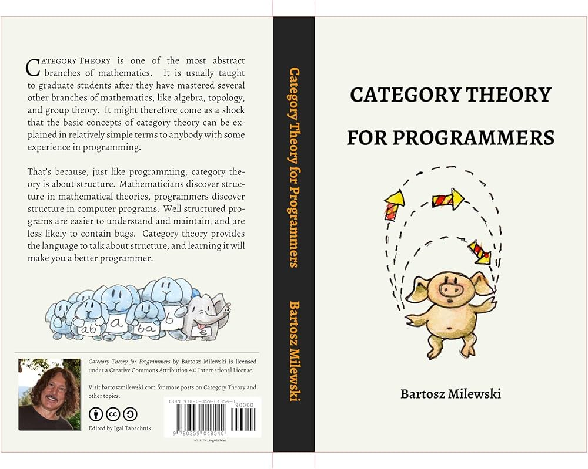

## Category Theory for Programmers - Bartosz Milewski




<br/>
<br/>

#### CHAPTER01. 카테고리: 합성의 본질

>카테고리는 대상과 그 사이를 이어주는 화살표로 구성된다. 따라서 카테고리의 본질은 합성이다. 반드시 대상 A에서 C로 향하는 화살표, 즉 A->B와 B->C의 합성이 존재해야한다.

> 합성을 만족시키기 위해서는 두가지 조건이 필요하다. 바로 결합법칙 성립과 모든 대상 A에는 항등 개념을 가진 화살표가 존재해야한다는 것이다.

> 함수의 본문은 항상 표현식(expression)이며, 문(statement)은 존재하지 않는다. (반환값이 반드시 있다.)

> 즉 우아한 코드는 우리의 뇌가 처리할 수 있는 적절한 크기, 적절한 개수의 청크를 만들어내는 것이라고 볼 수 있다. 그렇다면 적합한 청크는 무엇일까? 먼저 청크의 면적은 청크의 부피보다 느리게 증가해야한다. (면적: 외부에서 필요한, 합성하는데 필요한 정보, 부피: 구체적인 구현 정보)

> 객체지향에서 면적은 클래스나 인터페이스이지만, 함수형에서는 함수의 선언이라고 볼 수 있다.

```javascript
const add = (a, b) => a + b;
```
- **면적**: add 함수의 입력과 출력은 그 면적입니다. 즉, 이 함수는 두 개의 숫자를 받아 그 합을 반환하는 역할이 면적이다.
- **부피**: add 함수 내부에서 실제로 a + b라는 덧셈이 수행되는 연산이 부피

<br/>

#### CHAPTER02. 타입과 함수
>타입체킹은 무의미하게 작성된 프로그램에 대한 하나의 방어막이다. 정적체크되는 타입 불일치는 컴파일 타임에 발견되기 때문에 굳이 실행해 보지않더라도 잘못된 프로그램을 잡아낸다.
>

<br/>


